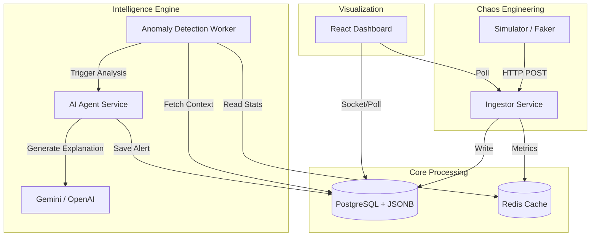
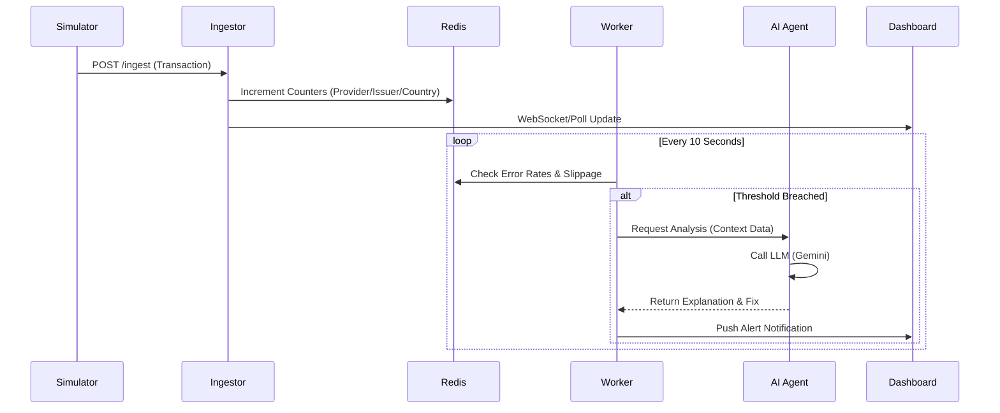
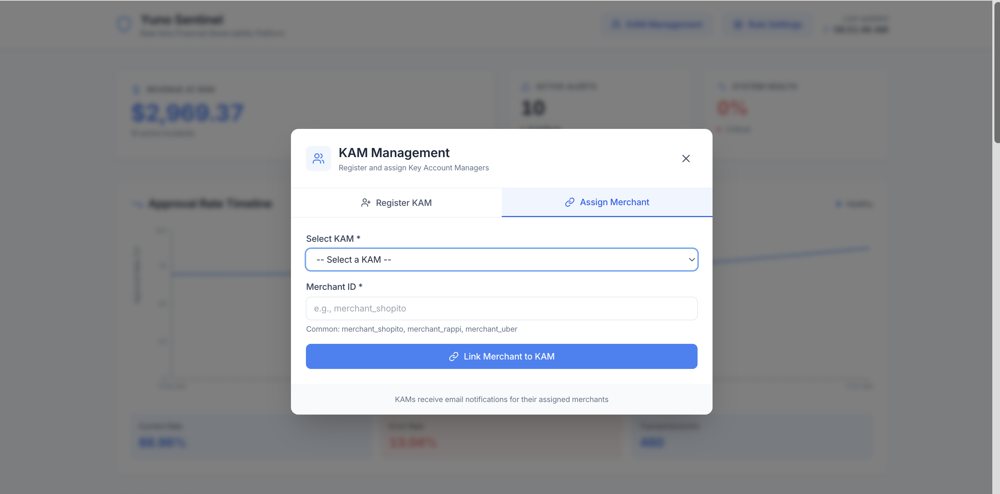
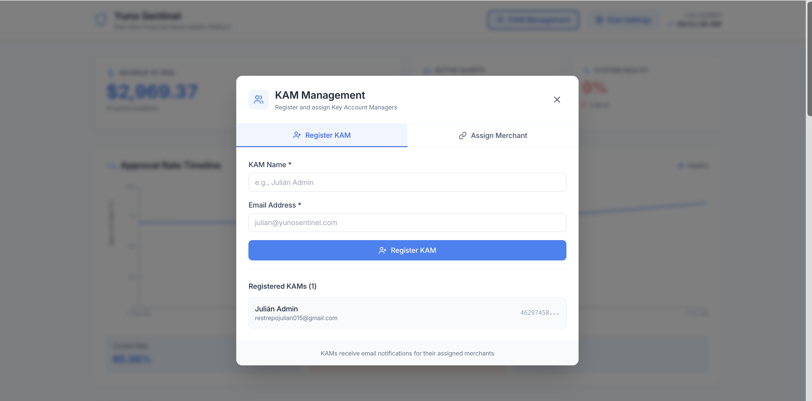
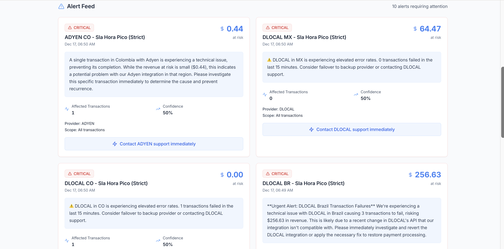
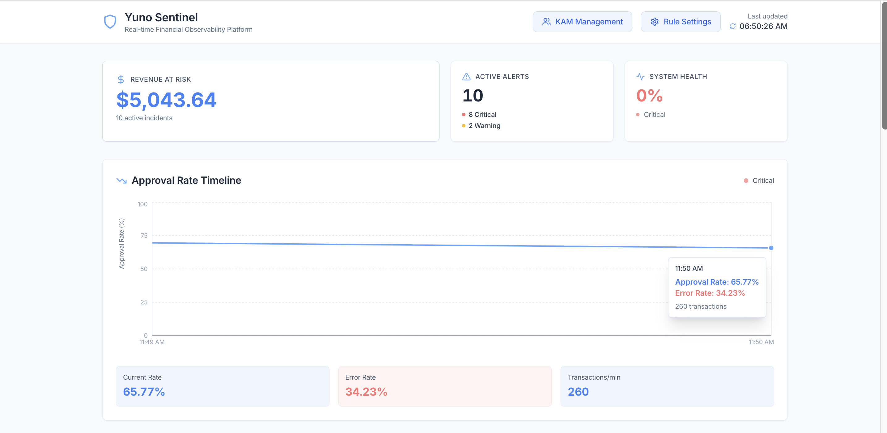
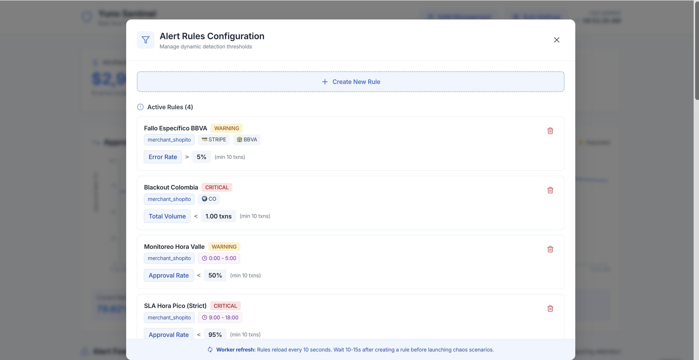

# 🌌 NEBULA - Intelligent Payment Telemetry & Self-Healing System

> **Team Nebula**  
> *Solution for Yuno Hackathon - Granular Alerts Challenge*

Nebula is a next-generation observability platform designed to solve the complexity of monitoring distributed payment architectures. It moves beyond generic alerts to provide **granular**, **entity-aware**, and **AI-explained** insights into payment failures.

---

## 📖 Table of Contents
- [Problem Statement](#-problem-statement)
- [Solution Overview](#-solution-overview)
- [Architecture](#-architecture)
- [Entity Modeling & Data Simulation](#-entity-modeling--data-simulation-faker-system)
- [Technology Stack](#-technology-stack)
- [Setup & Installation](#-setup--installation)
- [Usage Guide](#-usage-guide)

---

## 🚩 Problem Statement

In the current payment landscape, detecting falls in acceptance rates is reactive and generic. When a drop occurs, operational teams struggle to answer critical questions quickly:
- **Is it a Merchant problem?** (Misconfiguration, traffic shift?)
- **Is it a Provider issue?** (Global outage or local maintenance?)
- **Is it isolated to a specific Method or Country?**
- **Is it a BIN attack or legitimate fraud?**

Existing alerts are often "noise" — they lack correlation between entities (Merchant, Provider, Issuer, Country) and fail to distinguish between global outages and local incidents.

## 💡 Solution Overview

**Nebula** addresses this by implementing an intelligent telemetry pipeline that:
1.  **Ingests High-Velocity Data**: Capable of handling hundreds of transactions per second.
2.  **Detects Anomalies Granularly**: Using sliding windows and statistical deviation to spot issues at the *Issuer* and *BIN* level, not just the provider level.
3.  **Correlates Failures**: Automatically determines if an error is widespread or isolated.
4.  **Explains with AI**: Uses Large Language Models (Gemini/OpenAI) to generate human-readable root cause analyses and actionable suggestions.

---

## 🏗 Architecture

Nebula utilizes a microservices architecture to ensure scalability and separation of concerns.

### System Diagram



### Component Breakdown

#### 1. 🌪 Simulator (The Chaos Engine)
* **Role:** Generates realistic payment traffic and injects controlled failure scenarios.
* **Why:** To test the system's "Granular Intelligence," we need complex data patterns that simple load testing cannot provide. It simulates specific issuer downtimes, regulatory blocks, and provider timeouts.

#### 2. 🚀 Ingestor (FastAPI)
* **Role:** A high-performance API gateway that receives transaction data.
* **Why:** Decouples ingestion from processing, ensuring that heavy analysis doesn't slow down transaction recording.

#### 3. 🧠 Worker (The Brain)
* **Role:** Runs background jobs to analyze metric windows in Redis.
* **Why:** Performs statistical analysis to detect deviations in Approval Rates (SR) and Error Rates at specific granularities (e.g., "Stripe MX" vs "Stripe Global").

#### 4. 🤖 AI Agent (The Analyst)
* **Role:** When an anomaly is detected, this service constructs a prompt with context and asks the LLM to explain the incident.
* **Why:** Turns raw error codes ("504 Gateway Timeout") into actionable business intelligence ("Stripe is timing out specifically for BBVA Mexico cards").

#### 5. 📊 Dashboard (The Cockpit)
* **Role:** Real-time visualization of KPIs, anomalies, and AI insights.
* **Why:** Provides a clear "single pane of glass" for operations teams.

---

## 🎲 Entity Modeling & Data Simulation (Faker System)

We rigorously modeled our data to reflect real-world payment complexity, adhering to **Yuno's official documentation** standards.

### Data Schema
We use a **Hybrid Data Model** (Relational + document-based JSONB) to allow for flexible querying of arbitrary payment metadata while maintaining strict integrity for core fields.

| Field | Description | Example |
|-------|-------------|---------|
| `merchant_id` | Unique identifier for the client | `merchant_shopito` |
| `provider_id` | The processor handling the payment | `STRIPE`, `ADYEN` |
| `country` | ISO 3166-1 alpha-2 code | `MX`, `CO`, `BR` |
| `payment_method` | Detailed breakdown of the instrument | `{ type: "CARD", detail: { brand: "VISA", issuer: "BBVA" } }` |
| `status` | High-level outcome | `APPROVED`, `DECLINED`, `ERROR` |
| `sub_status` | Granular reason code | `INSUFFICIENT_FUNDS`, `DO_NOT_HONOR` |

### The "Faker" System
Our simulator in `/simulator/main.py` is not just a random string generator. It models:
* **Issuer Distribution**: Correctly assigns banks to countries (e.g., BBVA to Mexico, Itaú to Brazil).
* **BIN Ranges**: Generates valid BINs for specific card brands.
* **Chaos Scenarios**:
    * `STRIPE_TIMEOUT`: Simulates latency spikes specifically between Stripe and specific issuers.
    * `REGULATORY_BLOCK`: Simulates sudden compliance blocks (Code 57) for entire regions.
    * `BIN_ATTACK`: Simulates fraud velocity on specific BIN ranges.

---

## 🛠 Technology Stack

| Technology | Purpose | Justification |
|------------|---------|---------------|
| **Python (FastAPI)** | Backend API | High performance (async support) and rapid development speed. |
| **PostgreSQL 15** | Database | Robust relational support combined with powerful `JSONB` indexing for flexible query patterns. |
| **Redis 7** | Cache/Metrics | Ultra-low latency for sliding window counters (essential for real-time anomaly detection). |
| **Google Gemini** | AI / LLM | Provides intelligent context awareness and explains complex error correlations. |
| **React + Vite** | Frontend | Modern, component-based UI for a responsive and performant dashboard. |
| **Docker Compose** | Orchestration | Simplifies deployment and ensures environment consistency across the team. |

---

## 🚀 Setup & Installation

### Prerequisites
* Docker & Docker Compose
* An API Key for Google Gemini (or OpenAI if configured)

### 1. Clone the Repository
```bash
git clone https://github.com/Julianlamaravilla/Yuno_Nebula.git
cd Yuno_Nebula
```

### 2. Configure Environment
Run the setup script to generate your environment files:
```bash
./setup.sh
```
*Edit the `.env` file to add your API Key:*
```bash
GEMINI_API_KEY=your_actual_key_here
```

### 3. Launch Services
```bash
docker-compose up --build -d
```
*This command will start the Database, Redis, Ingestor, Worker, AI Agent, Simulator, and Dashboard.*

### 4. Verify Installation
Check if the services are running:
```bash
docker-compose ps
```

---

## 🎮 Usage Guide

### Accessing the Dashboard
Navigate to [http://localhost:3000](http://localhost:3000) in your browser.

**What you will see:**
* **Revenue at Risk**: Real-time calculation of potential money lost due to failures.
* **Live Feed**: A stream of transactions with their status.
* **AI Alerts**: When the system detects a failure pattern (e.g., "High decline rate on BBVA Mexico"), an alert card will appear with an AI-generated explanation and suggested fix.

### Triggering Chaos
You can control the chaos simulation by modifying the `simulator` logic or watching it auto-inject failures (5% probability by default).

To manually inspect logs and see the "Worker" detecting these patterns:
```bash
docker-compose logs -f worker
```
You will see output indicating when thresholds are breached and when the AI Agent is invoked.

---

### 📄 Sequence Diagram of an Alert



---

> **Hackathon Note**: This system was built to demonstrate how **granular data** combined with **Generative AI** can transform observability from a passive monitoring task into an active, problem-solving intelligence.

---

## 📸 Screenshots

### KHAM Management


### KHAM One


### Alert Feed


### Metrics


### Rules Settings

